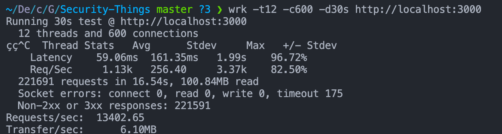
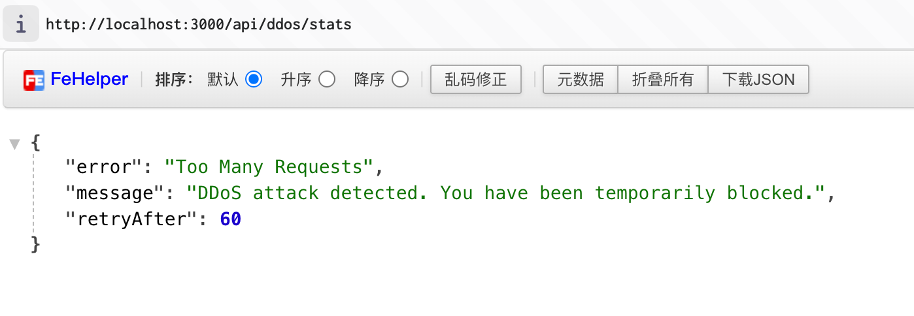
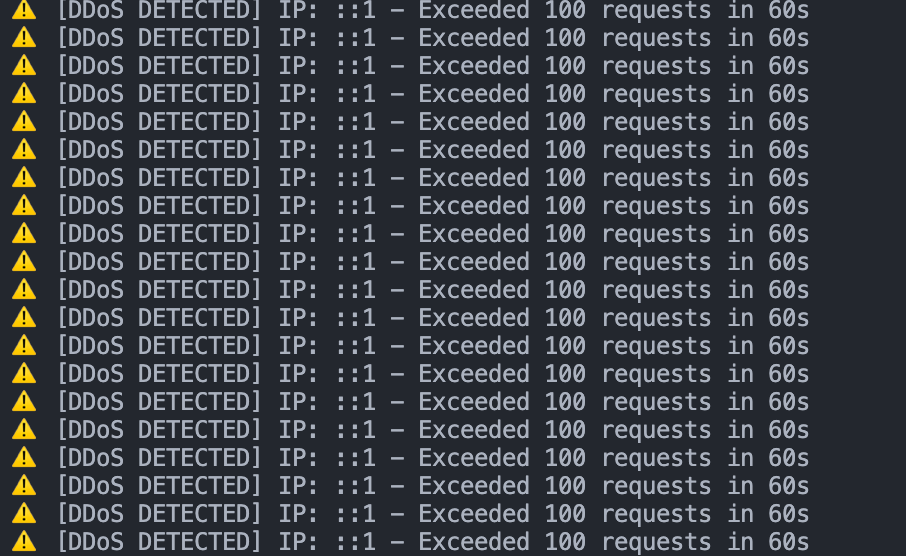

## DDoS

A **DDoS(Distributed Denial of Service)** attack happens when many machines send huge numbers of requests to a target server at the same time, causing it to

    •	use 100% CPU
    •	run out of memory
    •	exhaust connection pools
    •	crash or become extremely slow

### DDoS Attack Types

1. **HTTP Flood**: Massive GET/POST requests
2. **SYN Flood**: Tons of half-open TCP connections
3. **UDP Flood**UDP Flood: High-volume UDP packets
4. **Slowloris**: Very slow HTTP headers → hold connections

### How to simulate a DDos attack: HTTP Flood

Now I will simulate a DDoS attack using the [wrk](https://github.com/wg/wrk) tool.

```bash
brew install wrk

cd server

pnpm install # Install dependencies

pnpm run dev # Run the project

wrk -t12 -c400 -d30s http://localhost:3000/api/ddos/stats # This will launch 12 threads, 400 connections, and run for 30 seconds

```



#### How to protect against an HTTP Flood attack?

1. **Rate Limiting**: Limit the number of requests per second per IP address. [See this](./server/src/middleware/ddosProtection.ts)



